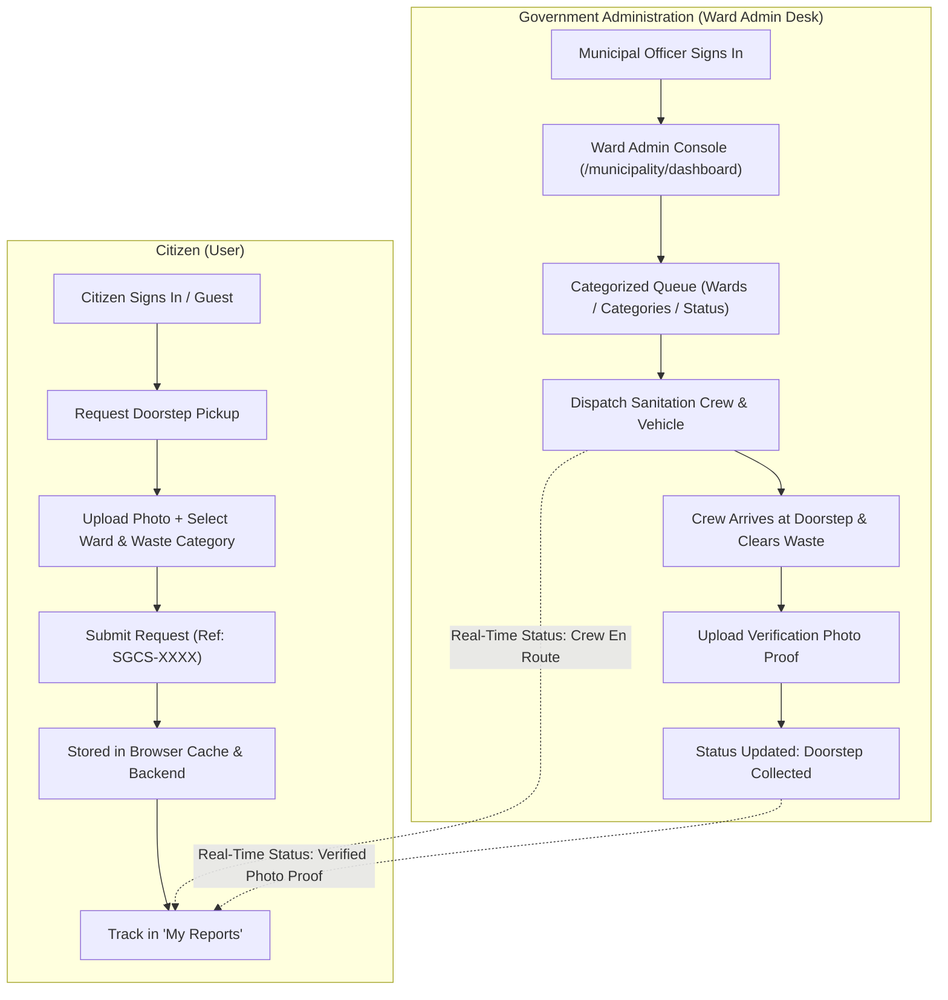

# SGCS — Smart Garbage Collection System

[](https://nextjs.org/)
[](https://www.typescriptlang.org/)
[](https://tailwindcss.com/)
[](https://github.com/Arunmohankml/SGCS---Smart-garbage-collection-system)

> **On-Demand Doorstep Waste Collection & Municipal Fleet Dispatch Platform**  
> Connecting citizens directly with local municipal sanitation authorities across Tamil Nadu for categorized waste collection, automated fleet routing, and verified doorstep cleanup proofs.

---

## 📌 Table of Contents

1. [Project Overview](#-project-overview)
2. [Key Capabilities](#-key-capabilities)
   - [For Citizens](#for-citizens)
   - [For Municipal Authorities (Ward Admin Desk)](#for-municipal-authorities-ward-admin-desk)
3. [Supported Municipalities](#-supported-municipalities-tamil-nadu)
4. [Waste Segregation Categories](#-waste-segregation-categories)
5. [System Workflow & Architecture](#-system-workflow--architecture)
6. [Tech Stack](#-tech-stack)
7. [Project Structure](#-project-structure)
8. [Getting Started](#-getting-started)
   - [Prerequisites](#prerequisites)
   - [Installation](#installation)
   - [Running Locally](#running-locally)
   - [Production Build](#production-build)
9. [API Reference](#-api-reference)
10. [Session & Cache Storage](#-session--cache-storage)

---

## 🌟 Project Overview

Traditional municipal waste collection often suffers from rigid truck schedules, overflow in residential dumpsters, and lack of accountability. **SGCS (Smart Garbage Collection System)** modernizes this entire pipeline:

- **Citizens** request doorstep garbage or recyclable collection through the web in under 60 seconds whenever their bins are full.
- **Municipal Authorities** review requests in a categorized dispatch console (by ward, waste category, and urgency) and send specific sanitation vehicles/crews directly to the citizen's doorstep.
- **Privacy & Direct Tracking**: No cluttered public complaint boards. Citizens track their own requests in **"My Reports"**, complete with assigned vehicle details and timestamped photo verification upon collection.

---

## 🚀 Key Capabilities

### For Citizens
- **Doorstep Pickup Request**: Select waste category, quantity estimate (Small, Medium, Truckload), preferred collection window (Morning, Afternoon, Urgent), address, and landmark.
- **AI Waste Classification**: Upload or capture a photo of the waste; an integrated detection model classifies the waste category and computes urgency priority scores.
- **Browser-Cached Citizen Login**: Instant sign-in via Name, Mobile Number, and Municipality Ward. Sessions persist seamlessly across page reloads in browser storage.
- **Personal "My Reports" Tracker**: Dedicated dashboard showing only the citizen's personal pickup requests with live status:
  - `Pending Pickup`
  - `Crew En Route / Dispatched` (displays assigned sanitation truck & crew name)
  - `Doorstep Collected` (displays verified resolution cleanup photo proof)
- **Direct Search & Filters**: Filter personal requests by waste category, collection status, or search by tracking code (`SGCS-XXXX`).

### For Municipal Authorities (Ward Admin Desk)
- **Municipal Authority Login**: Role-based authentication covering all 14 designated municipality jurisdictions.
- **Real-Time KPI Cards**: Monitor Total Requests, Pending Pickups, Dispatched Crews, and Cleared Pickups at a glance.
- **Clean Expandable Dropdown Filters**:
  - Filter by **Municipality Ward** (with real-time count badges)
  - Filter by **Waste Category**
  - Filter by **Collection Status**
  - Global Search across addresses, tracking codes, phone numbers, and crew names.
- **Crew & Vehicle Dispatch**: Assign specialized sanitation vehicles:
  - *Sanitation Truck #01 - Morning Shift*
  - *Eco-Recycle Van #03 - Dry Waste Team*
  - *Heavy Haulage Truck #08 - Bulky Unit*
  - *Green Squad #04 - Organic Logistics*
  - *Bio-Hazard Van #02 - Specialized Handling*
- **Resolution Proof Upload**: Sanitation crew takes a photo of the cleared doorstep to close the ticket and provide photographic verification to the citizen.

---

## 🏛 Supported Municipalities (Tamil Nadu)

SGCS is pre-configured with 14 municipal administrative jurisdictions:

| # | Municipality | Region |
|---|---|---|
| 1 | **Poonamallee** | Chennai West Suburbs |
| 2 | **Thiruverkadu** | Chennai West Suburbs |
| 3 | **Thiruninravur** | Tiruvallur District |
| 4 | **Kundrathur** | Kanchipuram District |
| 5 | **Mangadu** | Chennai West Suburbs |
| 6 | **Sriperumbudur** | Kanchipuram District Industrial Belt |
| 7 | **Walajabad** | Kanchipuram District |
| 8 | **Tirukalukundram** | Chengalpattu District |
| 9 | **Nandivaram-Guduvancheri** | Chengalpattu District |
| 10 | **Maraimalai Nagar** | Chengalpattu District |
| 11 | **Chengalpattu** | Chengalpattu District Headquarters |
| 12 | **Ponneri** | Tiruvallur District |
| 13 | **Tiruttani** | Tiruvallur District |
| 14 | **Arakkonam** | Ranipet District |

---

## ♻ Waste Segregation Categories

To ensure scientific recycling and disposal, requests are categorized into 6 streams:

1. **Kitchen & Wet Waste**: Food scraps, vegetable peels, banquet waste, biodegradable materials.
2. **Dry Recyclables**: Cardboard boxes, paper packaging, plastics, glass bottles, metal cans.
3. **E-Waste & Electronics**: Old electronic appliances, lithium-ion batteries, wires, circuit boards.
4. **Bulky & Furniture Debris**: Old mattresses, wooden furniture, renovation waste, bulky debris.
5. **Hazardous & Sanitary**: Expired chemicals, paint containers, medical or sanitary waste.
6. **Garden & Green Waste**: Pruned branches, dry leaves, grass clippings, landscaping waste.

---

## 🔄 System Workflow & Architecture



---

## 💻 Tech Stack

| Layer | Technology | Details |
|---|---|---|
| **Framework** | **Next.js 15.5** (App Router) | Server-side rendering, client components, API routes |
| **Language** | **TypeScript 5.0** | End-to-end type safety |
| **Styling** | **Tailwind CSS 3.4** | Modern responsive styling, custom design system |
| **Icons** | **Lucide React** | Consistent iconography throughout UI |
| **State & Cache** | **React Hooks + LocalStorage** | Synchronized multi-tab storage with custom event dispatching |
| **AI Detection** | **YOLO / Edge API** (`/api/detect`) | Waste segregation confidence & priority scoring |
| **Database** | **Supabase / PostgreSQL** | Cloud persistence with local offline fallback |
| **Fonts** | **DM Sans & Geist Mono** | Google fonts via `next/font` |

---

## 📂 Project Structure

```
CivicEye/
├── app/
│   ├── api/
│   │   ├── auth/           # Session management & logout
│   │   ├── detect/         # AI waste detection & priority score
│   │   ├── issues/         # Pickup request CRUD endpoints
│   │   └── upload/         # Media upload handling
│   ├── issues/             # Redirects to /my-reports
│   │   └── [id]/           # Individual ticket detail view
│   ├── login/              # Citizen login page
│   ├── municipality/       # Municipal authority login & desk
│   │   └── dashboard/      # Ward Admin Console (Categorized dispatch)
│   ├── my-reports/         # Personal citizen report tracker (no public feed)
│   ├── report/             # Doorstep waste pickup request form
│   ├── globals.css         # Global Tailwind styles & light theme tokens
│   ├── layout.tsx          # Root layout with DM Sans & light theme
│   └── page.tsx            # Modern homepage with hero & feature sections
├── components/
│   ├── auth/
│   │   ├── citizen-login.tsx       # Citizen auth with name, phone, ward
│   │   └── municipality-login.tsx  # Authority jurisdiction login
│   ├── issues/
│   │   ├── issue-card.tsx          # Ticket card with status & photo proof
│   │   ├── issue-detail.tsx        # Detailed ticket view
│   │   ├── issue-drawer.tsx        # Slide-over quick preview drawer
│   │   └── my-reports-view.tsx     # Citizen-only personal queue
│   ├── landing/
│   │   ├── header.tsx              # High-contrast navbar (Home, My Reports, Admin)
│   │   ├── hero.tsx                # Hero section with direct CTAs
│   │   ├── how-it-works.tsx        # 4-step doorstep pickup workflow
│   │   ├── ai-features.tsx         # AI segregation & classification
│   │   ├── municipality.tsx        # Admin dispatch overview
│   │   ├── faq.tsx                 # Frequently asked questions
│   │   ├── cta.tsx                 # Bottom call-to-action
│   │   └── footer.tsx              # Clean footer navigation
│   ├── municipality/
│   │   └── dashboard.tsx           # Full Ward Admin Console with dropdown filters
│   ├── report/
│   │   └── report-form.tsx         # Doorstep collection booking form
│   └── ui/
│       ├── badge.tsx               # Status badges (Pending, Dispatched, Collected)
│       ├── button.tsx              # Reusable button primitive
│       └── logo.tsx                # SGCS brand logo component
├── lib/
│   ├── auth.ts                     # User session management (citizen & authority)
│   ├── issues-store.ts             # Reactive store with localStorage sync
│   ├── mock.ts                     # Mock interface (clean zero-data queue)
│   ├── types.ts                    # TypeScript types & 14 municipality definitions
│   └── utils.ts                    # Class merging and utility helpers
├── tailwind.config.ts
└── tsconfig.json
```

---

## 🛠 Getting Started

### Prerequisites
- **Node.js**: `v18.18.0` or higher
- **npm**: `v9.0.0` or higher (or `pnpm` / `yarn`)

### Installation

1. Clone the repository:
   ```bash
   git clone https://github.com/Arunmohankml/SGCS---Smart-garbage-collection-system.git
   cd SGCS---Smart-garbage-collection-system
   ```

2. Install dependencies:
   ```bash
   npm install
   ```

### Running Locally

Start the Next.js development server:
```bash
npm run dev
```

Open your browser and navigate to:
```
http://localhost:3000
```

- **Homepage**: `http://localhost:3000/`
- **Request Pickup**: `http://localhost:3000/report`
- **Citizen "My Reports"**: `http://localhost:3000/my-reports`
- **Citizen Login**: `http://localhost:3000/login`
- **Ward Admin Desk**: `http://localhost:3000/municipality`
- **Admin Console**: `http://localhost:3000/municipality/dashboard`

### Production Build

To verify type safety and produce an optimized production bundle:
```bash
npx tsc --noEmit
npm run build
npm run start
```

---

## 📡 API Reference

### `POST /api/detect`
Analyzes uploaded waste photos for AI segregation classification and priority scoring.
- **Request**: `multipart/form-data` with `file` and `remarks`.
- **Response**: `{ category: IssueCategory, confidence: number, priorityScore: number }`

### `POST /api/issues`
Creates a new doorstep waste collection request.
- **Body**:
  ```json
  {
    "category": "dry_recyclable",
    "quantityEstimate": "3-5 Bags (Medium)",
    "pickupWindow": "Morning (8 AM - 12 PM)",
    "municipality": "Poonamallee",
    "address": "Door #14, Trunk Road",
    "landmark": "Near Bus Terminus",
    "contactPhone": "98451 22310",
    "location": { "lat": 13.0487, "lng": 80.0935 },
    "image": "data:image/jpeg;base64,..."
  }
  ```
- **Response**: `201 Created` with `{ id, reference, status }`

### `GET /api/issues`
Fetches active collection requests for administrative dispatching.
- **Response**: `{ issues: Issue[] }`

---

## 💾 Session & Cache Storage

The application utilizes high-performance browser caching (`localStorage`) with cross-tab event listeners:
- `sgcs_user_session`: Stores logged-in citizen profile (name, phone, municipality, role).
- `sgcs_my_report_ids_v1`: Keeps track of requests created by the user on the device, ensuring their private "My Reports" queue is instantly available even after refreshing.
- `sgcs_garbage_requests_v1`: Offline-resilient store for newly scheduled doorstep requests.

---

## 📄 License

Developed for modern civic sanitation management under the **MIT License**.
Distributed to streamline waste management for citizens and municipal corporations across Tamil Nadu.
